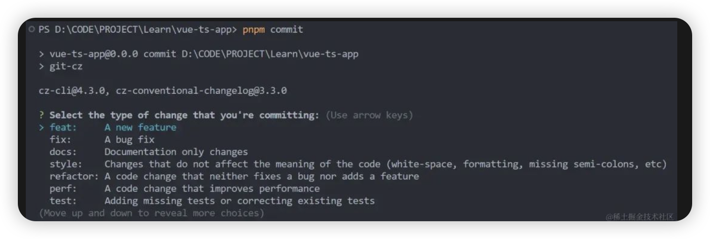

# vue3-admin
Vite+Vue3+TS+AntDV4+unocss+pinia 项目搭建

初始化Vue3+TS项目
```shell
npm create vite@latest vue-ts-app -- --template vue-ts
```
代码未动，规范先行
```shell
git init
```

**Eslint配置**
```shell
pnpm add eslint -D
```
初始化Eslint
```shell
# pnpm eslint --init 跑不起来， 提示运行指令
npm init @eslint/config
```
等待安装完（pnpm超快的），可以看到根目录多了个.eslintrc.mjs文件

在package.json的script中添加一个lint命令
```json
// eslint src 指定lint当前项目中的src文件夹下的文件
  // --ext 为指定lint哪些后缀的文件
  // --fix 开启自动修复
  "eslint": "eslint src --ext .js,.vue,.ts,.jsx,.tsx --ignore-path .gitignore --fix"

```

去VSCode扩展商店安装Eslint
完事后在根目录下的.vscode文件夹下创建一个settings.json文件，写上以下代码，实现每次保存代码时，自动执行lint命令来修复代码的错误。
```json
{
    // eslint
    "editor.codeActionsOnSave": {
        "source.fixAll": "never",
        "source.fixAll.eslint": "always"
    },
}
```

把.gitignore里的这两行删掉，把配置文件也提交上去跟小伙伴们同步。
```.gitignore
.vscode/*
!.vscode/extensions.json
```

**Prettier配置**


```shell
pnpm add prettier -D
```
在根目录下创建.prettierrc.js配置文件，写入我写好的内容，当然你也可以查阅官方文档[7]做自己团队的规范。
```js
/** .prettierrc.js
 * 在VSCode中安装prettier插件 打开插件配置填写`.prettierrc.js` 将本文件作为其代码格式化规范
 * 在本文件中修改格式化规则，不会同时触发改变ESLint代码检查，所以每次修改本文件需要重启VSCode，ESLint检查才能同步代码格式化
 * 需要相应的代码格式化规范请自行查阅配置，下面为默认项目配置
 */
module.exports = {
  // 一行最多多少个字符
  printWidth: 150,
  // 指定每个缩进级别的空格数
  tabWidth: 2,
  // 使用制表符而不是空格缩进行
  useTabs: false,
  // 在语句末尾是否需要分号
  semi: false,
  // 是否使用单引号
  singleQuote: true,
  // 更改引用对象属性的时间 可选值"<as-needed|consistent|preserve>"
  quoteProps: "as-needed",
  // 在JSX中使用单引号而不是双引号
  jsxSingleQuote: false,
  // 多行时尽可能打印尾随逗号。（例如，单行数组永远不会出现逗号结尾。） 可选值"<none|es5|all>"，默认none
  trailingComma: "es5",
  // 在对象文字中的括号之间打印空格
  bracketSpacing: true,
  // jsx 标签的反尖括号需要换行
  jsxBracketSameLine: false,
  // 在单独的箭头函数参数周围包括括号 always：(x) => x \ avoid：x => x
  arrowParens: "always",
  // 这两个选项可用于格式化以给定字符偏移量（分别包括和不包括）开始和结束的代码
  rangeStart: 0,
  rangeEnd: Infinity,
  // 指定要使用的解析器，不需要写文件开头的 @prettier
  requirePragma: false,
  // 不需要自动在文件开头插入 @prettier
  insertPragma: false,
  // 使用默认的折行标准 always\never\preserve
  proseWrap: "preserve",
  // 指定HTML文件的全局空格敏感度 css\strict\ignore
  htmlWhitespaceSensitivity: "css",
  // Vue文件脚本和样式标签缩进
  vueIndentScriptAndStyle: false,
  //在 windows 操作系统中换行符通常是回车 (CR) 加换行分隔符 (LF)，也就是回车换行(CRLF)，
  //然而在 Linux 和 Unix 中只使用简单的换行分隔符 (LF)。
  //对应的控制字符为 "\n" (LF) 和 "\r\n"(CRLF)。auto意为保持现有的行尾
  // 换行符使用 lf 结尾是 可选值"<auto|lf|crlf|cr>"
  endOfLine: "crlf",
};
```
在package.json的script中添加一个prettier命令
```json
// eslint . 为指定lint当前项目中的文件
  // --ext 为指定lint哪些后缀的文件
  // --fix 开启自动修复
  "prettier": "prettier --write \"./**/*.{html,vue,ts,js,json,md}\"",
```
执行prettier命令即可格式化代码。

VSCode扩展商店安装Prettier - Code formatter插件

在.vscode/settings.json中添加一下规则即可实现保存自动格式化
```json
{
    // 保存的时候自动格式化
    "editor.formatOnSave": true,
    // 默认格式化工具选择prettier
    "editor.defaultFormatter": "esbenp.prettier-vscode"
}
```

**StyleLint配置**
Stylelint是针对css的Lint，可检查css语法错误和不合理的写法，指定css书写顺序等。
快速安装依赖
这里以less预处理器为例，其他预处理器如sass、stylus等自行搜索依赖安装嗷！
```shell
pnpm add stylelint postcss postcss-less postcss-html stylelint-config-recommended-less stylelint-config-standard stylelint-config-standard-vue stylelint-less stylelint-order -D
```
依赖说明
- stylelint: css样式lint工具（包含stylelint-config-prettier）
- postcss: 转换css代码工具
- postcss-less: 识别less语法
- postcss-html: 识别html/vue 中的标签中的样式
- stylelint-config-standard: Stylelint的标准可共享配置规则，详细可查看官方文档
- stylelint-config-recommended-less: less的推荐可共享配置规则，详细可查看官方文档
- stylelint-config-standard-vue: lint.vue文件的样式配置
- stylelint-less: stylelint-config-recommended-less的依赖，less的stylelint规则集合
- stylelint-order: 指定样式书写的顺序，在.stylelintrc.js中order/properties-order指定顺序


在根目录下创建.stylelintrc.cjs配置文件，写入以下内容，当然你也可以查阅官方文档做自己团队的规范。

在package.json的script中添加一个lint命令
```json
"lint:style": "stylelint \"./**/*.{css,less,vue,html}\" --fix"
```


VSCode扩展商店安装 Stylelint 插件
在.vscode/settings.json中添加一下规则即可实现保存自动格式化
```json
 // 保存的时候自动格式化Style
    "stylelint.validate": ["css", "less", "vue", "html"]
```

问题：打开vue文件提升 vue3 ''HelloWorld.vue"' has no default export.Vetur(1192)
解决： 安装插件 Vue - Official


团队协作
## Commitizen配置
团队协作中除了代码，免不了用Git进行版本控制和协同开发，但不是每个开发者在提交的时候都会认真书写，导致回溯代码版本时候摸不着头脑。
清晰且统一的提交描述（Commit message）风格，能够降低协作项目的维护成本，提高合作开发效率。使用Commitizen即可帮助我们设定一个标准。


**快速安装依赖**
安装commitizen和其适配器cz-conventional-changelog


```shell
pnpm add commitizen cz-conventional-changelog -D
```
在package.json的script中添加一个lint命令

```json
"commit": "git-cz"
```
在package.json中添加一个config配置
```json
"config": {
    "commitizen": {
      "path": "cz-conventional-changelog"
    }
  }
```
使用流程
配置好之后，就可以用pnpm commit代替之前的git commit了！执行命令后就会出现标准的提交类型选项，照着填就行。



**Husky配置**
最后再上一道保险，代码提交前的强制校验，保证那些没有按规定规范书写的老鼠屎代码不会坏了整锅前端项目粥，另外还能规范提交描述，属于团队协作必备的检验流程。 ~哈士奇~Hasky可以为 Git 客户端增加钩子（hooks）功能，让你在特定事件（如 commit、push）发生时触发自定义的代码审查、自动化测试、提交描述规范等任务。

**Husky安装和配置**
```shell
pnpm add husky@8.0.3 -D
```
在package.json的script中添加一个prepare命令

```json
"prepare": "husky install"
```
prepare脚本是 npm 的特殊脚本之一，它在npm install命令之后执行，这样项目的其他同学在装包的时候就会自动执行该命令来执行husky安装。 直接执行pnpm prepare，根目录会多一个.husky目录，然后运行以下husky命令添加pre-commit钩子。

```shell
pnpm husky .husky/pre-commit "pnpm eslint && pnpm prettier && pnpm lint:style"
```
执行后会在.husky目录下生成一个pre-commit文件。当git commit的时候就会执行pnpm eslint与pnpm prettier，如果命令出现报错，就不会提交成功，以此来保证提交代码的质量和格式规范！
```
#!/usr/bin/env sh
. "$(dirname -- "$0")/_/husky.sh"

pnpm eslint && pnpm prettier && pnpm lint:style
```
试一下，发现Eslint的逻辑报错能够终止git提交了

不过要注意的是，仅Eslint报的错误会终止Git提交，如果Eslint没问题，stylelint有问题，则会出现提交成功然后再自动修复的问题，导致提交上去的代码仍然是有问题的。解决方案就是用Lint-stage。

**Lint-staged安装和配置**
lint-staged可以在git staged阶段的文件上执行代码检查（Linters），包括ESLint和Stylelint等。好处是你可以通过设置只检查通过git add添加到暂存区的文件，避免每次检查都把整个项目的代码都检查一遍，从而提高效率，避免不必要的耗时。

**安装依赖**
```shell
pnpm add lint-staged -D
```
在package.json的script中添加一个pre-commit命令
```json
"pre-commit": "lint-staged"
```
新建 .lintstagedrc配置文件并添加以下命令
```json
{
  "src/**/*.{html,vue,ts,js,json,md}": [
    "prettier --write",
    "eslint --fix",
    "stylelint --fix"]
}
```

修改.husky/pre-commit文件，提交时执行lint-staged

```
#!/usr/bin/env sh
. "$(dirname -- "$0")/_/husky.sh"

pnpm run pre-commit
```
试一下，没问题！自动修复了。


**commitlint安装和配置**
最后再顺手把提交描述也规范下，术语叫“约定式提交（Conventional Commits）”，commit-msg可以帮助我们检查提交的消息是否符合规定，回看提交记录的时候不会头皮发
```shell
pnpm add @commitlint/config-conventional @commitlint/cli -D
```

根目录下新建.commitlint.config.cjs配置文件：
```js
module.exports = {
  extends: ['@commitlint/config-conventional'],
  rules: {
    'type-enum': [ // type枚举
        2, 'always',
        [
          'build', // 编译相关的修改，例如发布版本、对项目构建或者依赖的改动
          'feat', // 新功能
          'fix', // 修补bug
          'docs', // 文档修改
          'style', // 代码格式修改, 注意不是 css 修改
          'refactor', // 重构
          'perf', // 优化相关，比如提升性能、体验
          'test', // 测试用例修改
          'revert', // 代码回滚
          'ci', // 持续集成修改
          'config', // 配置修改
          'chore', // 其他改动
        ],
    ],
    'type-empty': [2, 'never'], // never: type不能为空; always: type必须为空
    'type-case': [0, 'always', 'lower-case'], // type必须小写，upper-case大写，camel-case小驼峰，kebab-case短横线，pascal-case大驼峰，等等
    'scope-empty': [0],
    'scope-case': [0],
    'subject-empty': [2, 'never'], // subject不能为空
    'subject-case': [0],
    'subject-full-stop': [0, 'never', '.'], // subject以.为结束标记
    'header-max-length': [2, 'always', 72], // header最长72
    'body-leading-blank': [0], // body换行
    'footer-leading-blank': [0, 'always'], // footer以空行开头
  }
}
```


在package.json的script中添加一个commitlint命令
```json
"commitlint": "commitlint --config .commitlint.config.cjs -e -V"
```
运行以下husky命令添加commit-msg钩子
```shell
pnpm husky add .husky/commit-msg "npm run commitlint"
```


资料： https://gitee.com/somecat/vite_vue3_ts_antdv4_unocss_template/tree/6618632fed05818a116d2571d20b6d1873b95540


